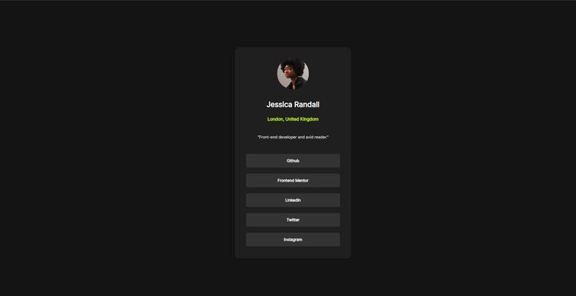

# Frontend Mentor - Social links profile solution

This is a solution to the [Social links profile challenge on Frontend Mentor](https://www.frontendmentor.io/challenges/social-links-profile-UG32l9m6dQ). Frontend Mentor challenges help you improve your coding skills by building realistic projects. 

## Table of contents

- [Overview](#overview)
  - [Screenshot](#screenshot)
  - [Links](#links)
- [My process](#my-process)
  - [Built with](#built-with)
  - [What I learned](#what-i-learned)
- [Author](#author)

## Overview

- This page showcases a simple yet modern-looking web page that features social links through different buttons as well as snippets to personal information.

### Screenshot

### Links

- Live Site URL: [Github Pages](https://kr0ma-git.github.io/Frontend-Mentor-Challenge-3/)

## My process

- Process was pretty straight forward throughout the challenge. Building the structure div-by-div didn't take too long and the overall format of the page wasn't so complicated.

### Built with

- Semantic HTML5 markup
- CSS custom properties
- Flexbox
- Mobile-first workflow

### What I learned

- Still struggling to work with responsive images and working with images is still a bit of an "awkward" experience personally so I really do have to work on that aspect of frontend more.

## Author

- Frontend Mentor - [@kr0ma-git](https://www.frontendmentor.io/profile/kr0ma-git)
- Github - [@kr0ma-git](https://github.com/kr0ma-git)